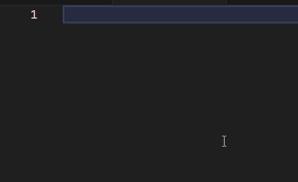

# markdown-wrap-code README

## Features

Wraps the selected text into triple backticks fence:



## Extension Command

Look for "Markdown Wrap in Triple Backticks" in the command palette.


## Extension Shortcut

Select the text to wrap and press `ctrl+E`.


## Known Issues

`ctrl+E` is usually already binded, you need to open the bindings editor (`ctrl+k` `ctrl+s`) and unbind.

To set your own shortcut, add this to your `keybindings.json`:

```
{
    "key": "ctrl+e",
    "command": "wrapInTripleBackticks",
    "when": "editorTextFocus"
}
```

### 1.0.0

Initial release of the extension.

## Contributing

### Source Code Editing

1. **Navigating to Your Project**: Navigate to your project directory in the terminal.

```bash
cd path/to/your/extension
```

2. **Opening in VS Code**: Open the project in Visual Studio Code if it's not already open.

```bash
code .
```

### Dependency Management

3. **Installing Dependencies**: If you've added new dependencies or are working on a different machine, you'll need to reinstall the npm packages.

```bash
npm install
```

### Building the Project

4. **Compiling TypeScript**: If your extension uses TypeScript, compile it into JavaScript.

```bash
tsc
```

Or, for continuous compilation:

```bash
tsc -w
```

if tsc is installed locally (`npm install --save-dev typescript`) and not globally (`npm install -g typescript`), run:
```bash
./node_modules/.bin/tsc
```

### Testing the Extension

5. **Running the Extension**: To test your changes, you can run the extension in a new Extension Development Host window.

Press `F5` in VS Code to start debugging and open a new window where your extension is activated.

### Debugging

6. **Insert Breakpoints**: Insert breakpoints in your code within VS Code to debug it.

7. **Inspect Output**: Use `console.log()` statements for simple debugging, and inspect the Output panel (`Ctrl+Shift+U`) in the Extension Development Host window.

### Versioning

8. **Update Version**: Before republishing your extension, remember to update the version number in `package.json`.

### Publishing

To package your Visual Studio Code extension, you can use the `vsce` command-line tool, which is designed to help you manage VS Code extensions. Here are the steps to package your extension:

1. **Install `vsce` if you haven't yet**:
```bash
npm install -g vsce
```

2. **Navigate to your extension directory**:
```bash
cd path/to/your/extension
```

3. **Install Dependencies**: Make sure all dependencies are installed. This usually means running:
```bash
npm install
```

4. **Compile the Project**: If you're using TypeScript, make sure to compile your project into JavaScript.
```bash
tsc
```

5. **Package the Extension**: Run the following command to package your extension into a `.vsix` file.
```bash
vsce package
```

After running this command, `vsce` will package your extension into a `.vsix` file. This `.vsix` file is what you'll upload to the Visual Studio Marketplace if you decide to publish your extension. Alternatively, you can install it manually using this `.vsix` file.

To install a `.vsix` manually, open Visual Studio Code, go to the Extensions view by clicking on the Extensions icon in the Activity Bar on the side of the window. Then click the "..." at the top of the Extensions view, choose "Install from VSIX..." and select your `.vsix` file.

You can also install it from the command line:

```bash
code --install-extension your-extension.vsix
```

Remember to replace `your-extension.vsix` with the actual file name of your `.vsix` file.

6. **Publishing the Extension**: If you've made changes that you want to publish, use the `vsce` (`npm install -g vsce`) package to publish the extension to the marketplace.

```bash
vsce publish
```